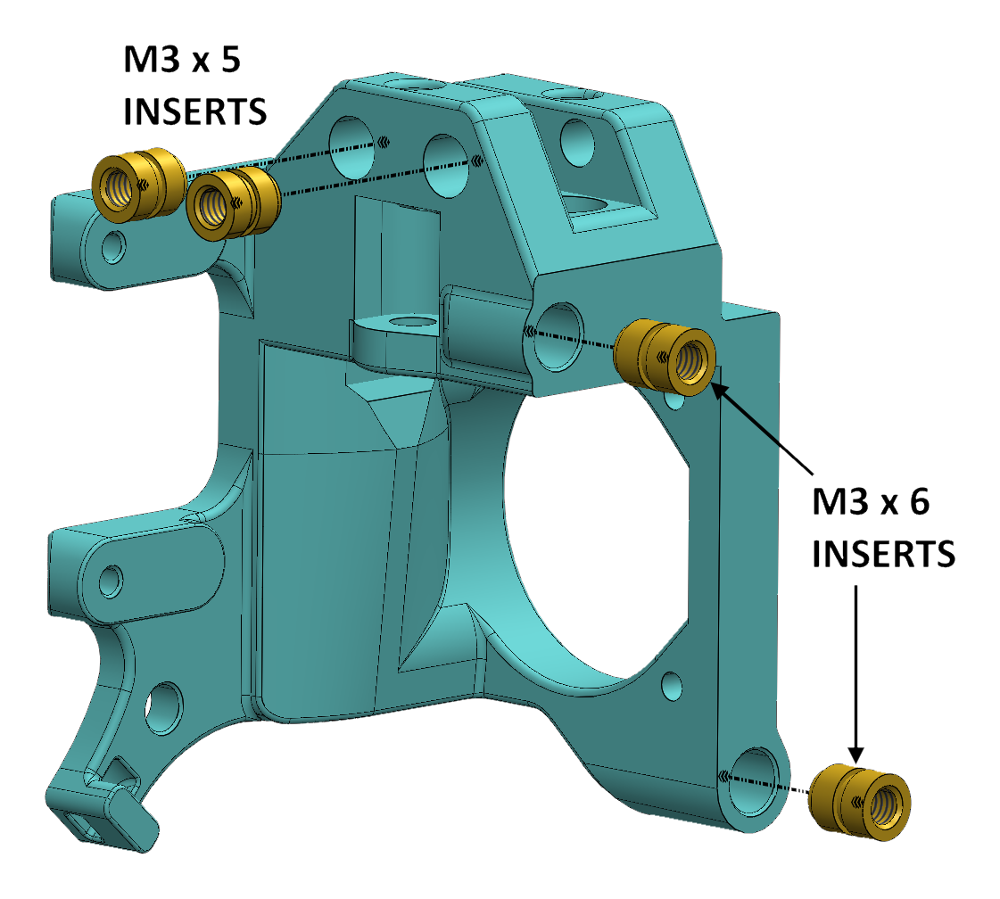
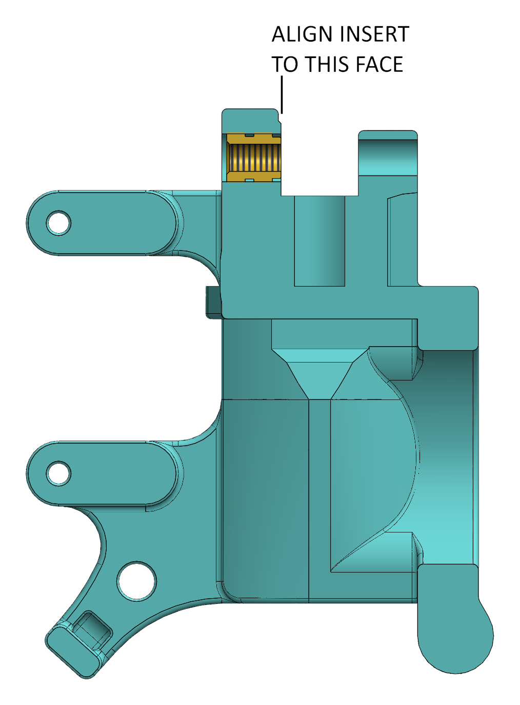
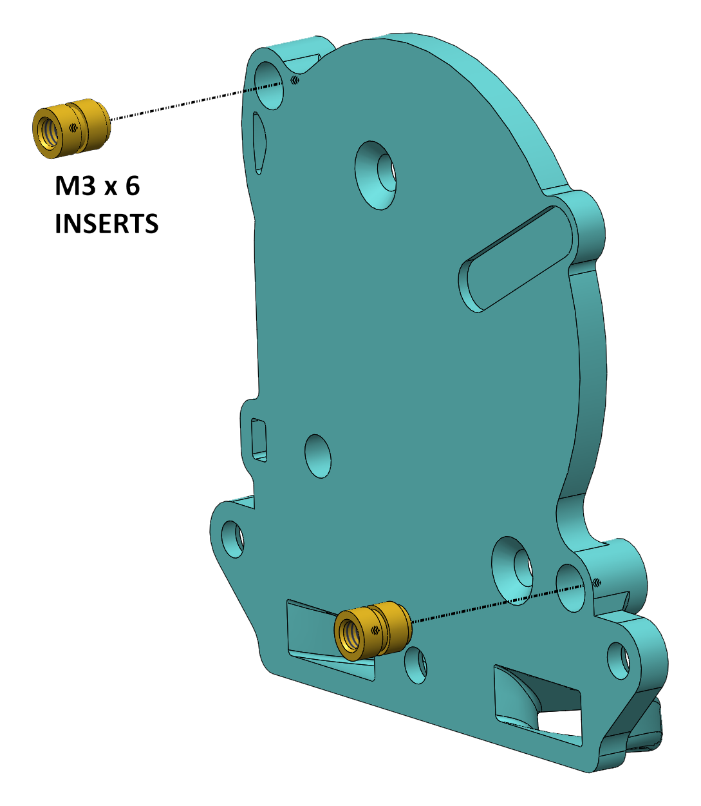
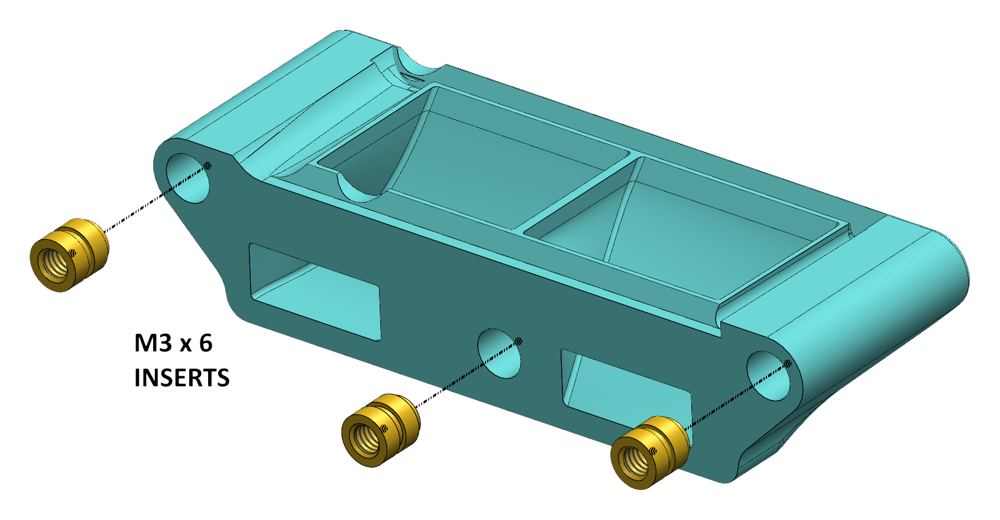
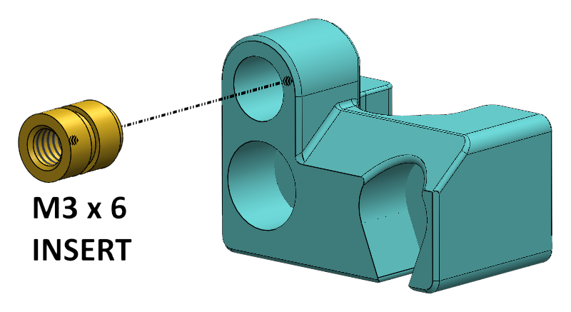
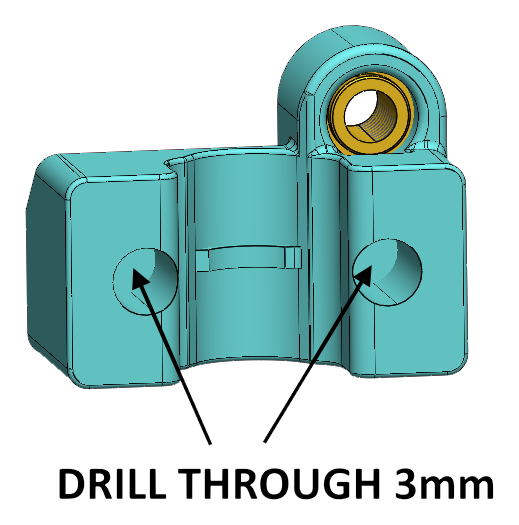
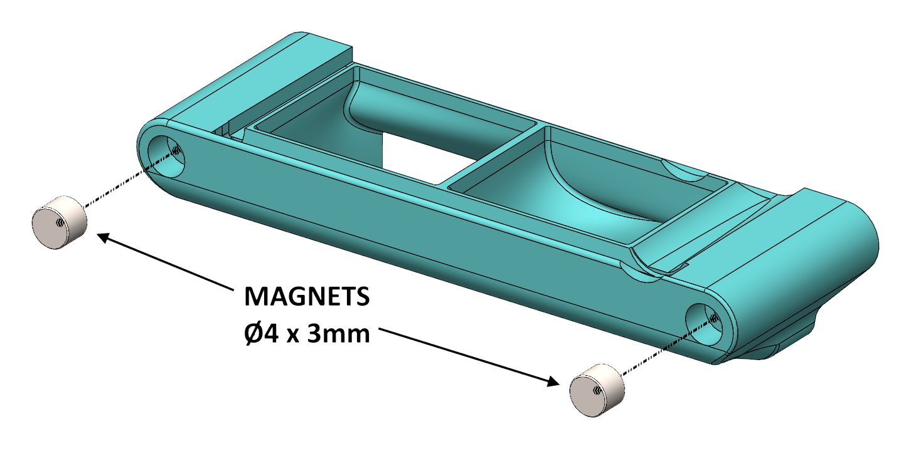
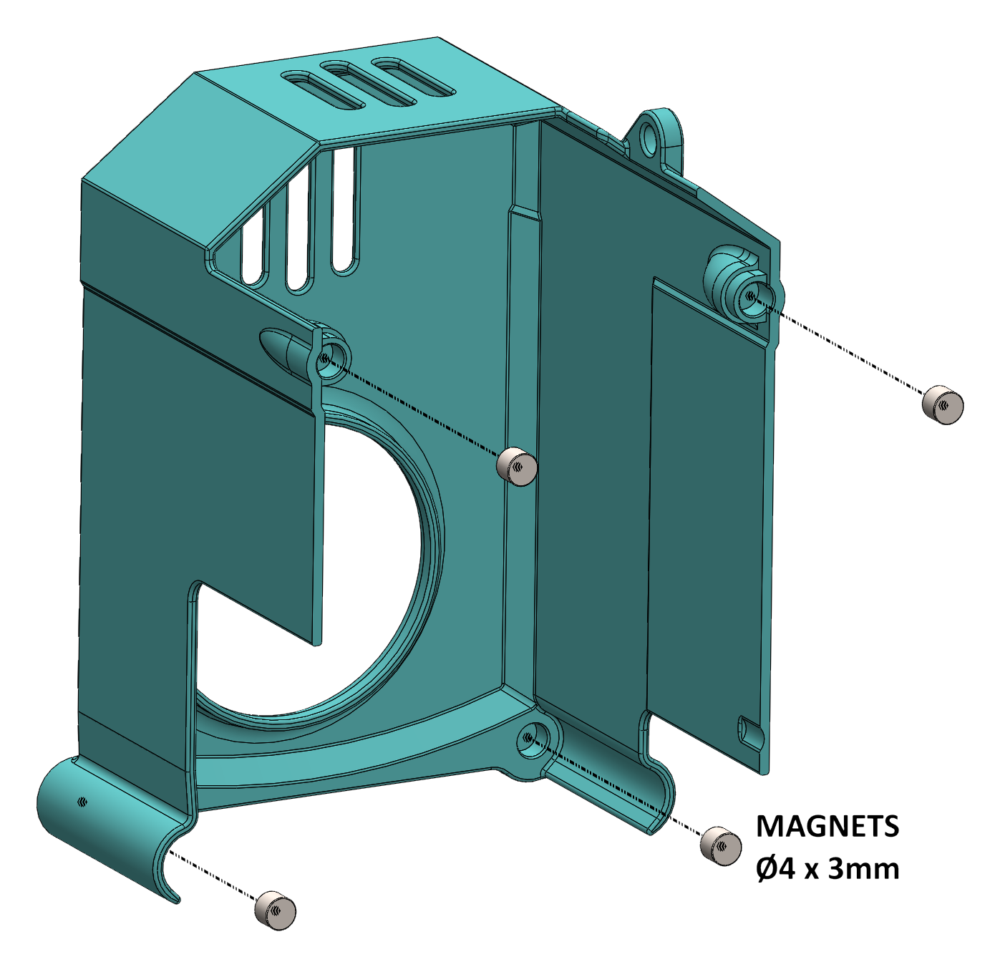

# SV08-PZ-Probe
E3D Revo PZ-Probe for the Sovol SV08

## Project Aims
1. To swap the supplied hot end and Z probe for the E3D Revo PZ-Probe.
2. To use as many of the existing parts as possible.
3. To work with the Sovol branch of Klipper.
4. 3D printed parts should not require support.

## New 3D printed parts 
The new 3d printed parts can be found in the STEP directory.  As most modern slicers can open STEP files directly this is the preferred format for this project.

The parts should be orientated correctly on import as shown below. All parts have been designed so that support is not required, provided your printer can cope with small bridges.

### Print Orientation

The prototype was printed in PETG on a Bambu Labs A1 mini, 0.16mm layer height, 3 wall loops, 100% infill.  If your Sovol SV08 has an enclosure or you plan on printing high temperature filamanets, ASA or ABS would be preferred.

Bambu Slicer project files (.3mf) for the parts are available in the 3mf folder.

## Printed Part Preparation

### Heat set inserts

The parts are designed around M3 x 6mm unflanged inserts, except for the upper two on the main mount, that should be M3 x 5mm.  If preferred, 5mm long inserts can be used in all locations. Alternatively, 6mm inserts can be used everywhere, if you don't mind them sticking out a little from the main mount.  The main mount upper inserts need to be aligned with the inside of the mounting slot for maximum strength and ease of assembly.  See the image below.

|  |  |

