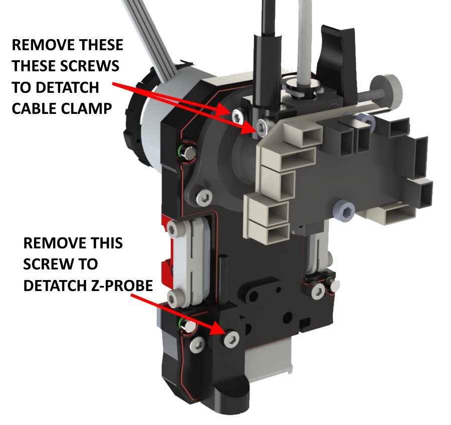
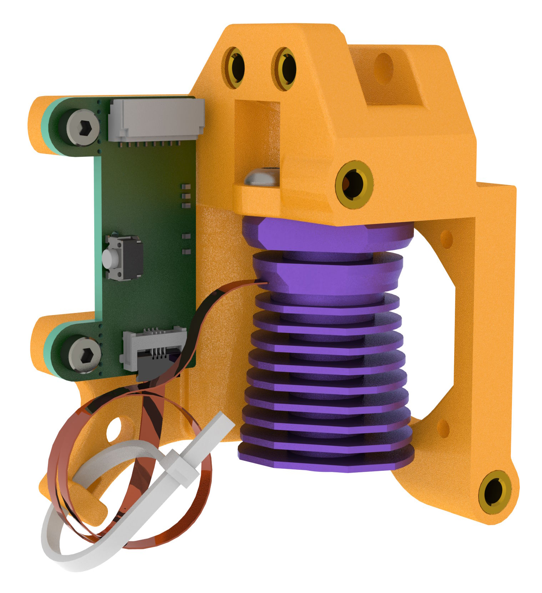

# SV08-PZ-Probe
E3D Revo PZ-Probe for the Sovol SV08

## Project Aims
1. To swap the supplied hot end and Z probe for the E3D Revo PZ-Probe.
2. To use as many of the existing parts as possible.
3. To work with the Sovol branch of Klipper.
4. 3D printed parts should not require support.

> [!IMPORTANT]
> Full details of the PZ probe can be found on the E3D support page at https://e3d-online.com/pages/e3d-support-pz-probe
> Please read these instruction thoroughly before proceeding. 

## New 3D printed parts 
The new 3d printed parts can be found in the STEP directory.  As most modern slicers can open STEP files directly this is the preferred format for this project.  STL files are available in the relevant folder

The parts should be orientated correctly on import as shown below. All parts have been designed so that support is not required, provided your printer can cope with small bridges.

### Print Orientation


The prototype was printed in PETG on a Bambu Labs A1 mini, 0.16mm layer height, 3 wall loops, 100% infill.  If your Sovol SV08 has an enclosure or you plan on printing high temperature filamanets, ASA or ABS would be preferred.

Bambu Slicer project files (.3mf) for the parts are available in the 3mf folder.

## Printed Part Preparation

### Heat set inserts

The parts are designed around M3 x 6mm unflanged inserts, except for the upper two on the main mount, that should be M3 x 5mm.  If preferred, 5mm long inserts can be used in all locations. Alternatively, 6mm inserts can be used everywhere, if you don't mind them sticking out a little from the main mount.  

All inserts should sit level or below the face of insertion.  Any plastic the bulges up should be removed, so that parts fir together without gaps.

#### Main Mount

The main mount upper inserts need to be aligned with the inside of the mounting slot for maximum strength and ease of assembly.  See the image below.

 

#### Fan mount with nozzles


#### Fan mount interface

Make sure the inserts sit below the mating face and remove any plastic preventing the mating face from sitting flat, to ensure an airtight seal with the nozzles.


#### Cable clamp

The cable clamp uses a sacrificial layer to support the counterbored screw holes.  This will need to be drilled through.

  

### Magnets

This design uses 4mm diameter x 3mm long neodium magnets.  I used these ones https://www.amazon.co.uk/dp/B0C81HTXTV

It is important to ensure that the magnets are inserted the correct way round.  The easiest way to ensure this is to snap the magnet to an already mounted one on the tool head and mark the non-contact face with a permanent marker.  The marked face goes at the bottom of the hole on the cover. With care, for some of the magnets, it is possible to push the mounting hole over the magnet while it is snapped in place.

#### Cover

Try to keep all the magnets orientated the same way.


#### Fan mount interface

Snap a magnets to each of the lower pair in the cover.  Slide the interface into the cover and press the two parts together.  Once the magnets are partially seated in the fan interface it can be removed and pressed against a flat surface to fully seat them.


## Stripping the exiting toolhead

1. Home the printer and raise the gantry above 250mm for ease of access with the head front and centre.
   
2. Disconnect the large fan and remove it from the cover.

    
    
3. Remove the standard nozzle and heatsink assembly as shown in this video:
   
   [](http://www.youtube.com/watch?v=bAOVA6bL-Jw)
   
4. Remove the small fan from the heatsink.  Keep the screws.
   
   
   
5. Unscrew the Z-Probe and disconnect the cable. Remove the cable clamp. You can optionally disconnect the power and usb connections for clearer access.
   
   

## PZ-Probe Assembly

Align the coldside on the mount so that the cable points away from the fan ring and assemble using M3x6 buttonhead screws.  The two side screws are placed in their cut-outs and the hex driver engages in their heads through the holes in the top.

 

Mount the PZ-probe board in place using the M2 capheads supplied with the board.  These screws will cut their own threads in the mount.


Loop the ribbon cable around and connect tto the pz-probe board.  Use a small zip tie to hold it in place.

 

Using the original 2 screws attach the cold end cooling fan.  4 holes are available but only two are needed.  The screws will cut their own thead.


The PZ-Probe comes with a short length of bowden tube. Cut this to 33.5mm, and insert through the mount until it bottoms in the heatsink.  


Insert the bowden tube into the toolhead as shown below and push up.  The mount will snap over the original heatsink mount. If the mount doesn't seat completely, trim a small amount off of the bowden tube and try again. 

 

Use two M3x20 and one M3x8 screws to secure the mount.  The screws enter from the opposite side compared to the original heatsink.


Combnine the part cooling fan interface and nozzle items together with three M3x8 countersunk screws


Fix this to the main mount with two M3x8 countersunk screws.  The next stage is the wiring and it's handy to have the fan mount in place to determine the wire lengths.


Slot the 5020 fan into the interface and fix with M3x25 screws and washers.  The washers help protect the fan case from splitting from the screw heads. 


The new screw clamp can be fitted at this stage with M3x12 screws or left until after the wiring is completed.


Test fit the cover to ensure the magnets snap together. An M3x8 screw can be used to permanently fix the cover.


This completes the mechanical assembly.

## PZ-Probe Wiring

> [!CAUTION]
> The supplied Z-probe on the Sovol SV08 uses 24V power.  **DO NOT** connect the PZ-probe board to the the same pin as this will burn out the PZ-probe control board.  Use the 5V pin on the lower right UART per the image below. 

The Sovol SV08 uses a variety of connectors. While the existing probe connector can be harvested, a second one is required for 5V power taken from the spare UART. Both connectors are JST-GH plugs with 1.25mm pin spacing: 5 pin for the probe and 4 pin for the UART. I used this kit from Amazon https://www.amazon.co.uk/gp/product/B0CW2NKVL7


Threee ground pins are available. I used the one on the UART to keep the wiring neat for the later addition of an X-axis limit microswitch.

> [!IMPORTANT]
> Full details of the PZ probe wiring and programming can be found on the E3D support page at https://e3d-online.com/pages/e3d-support-pz-probe

The wiring harness for the PZ-probe on the SV08 is shown below, along with the colour key for the wiring.  The blue, purple and grey wires were not used, but were terminated with a Dupont connector to keep things tidy.  

A second ground wire was spliced in for the connection to an USB-TTL or FTDI for programming the PZ-probe. This ground along with the RX and TX lines terminate in at a 3 pin Dupont connector.  


```
Wire colour and their function:
    Brown - GND (0V)
    Red - PWR (3.3V-5V)
    Orange - Trigger
    Yellow - RX
    Green - TX
    Blue - UPDI
    Purple - SCL
    Grey - SDA
```


## Hotend Wiring

If you don't have the right connectors on hand, harvest the ones from the Sovol heater and thermister.  Cut them off keeping 15mm to 20mm of wire tails attached.  Fit the E3D Revo hotend to the heatsink. The Revo has Molex connectors fitted and comes with extension cables.  For the initial setup I used the extension cables, but later removed them, cutting off the Molex, and soldering the cables to the toolhead connector tails, making sure there was a little slack in the cables once connected.

For mine I had a new plug for the heater and re-used the one from the original thermistor.  I also used some liquid insulation tape for strain relief. 


## Initial Testing

1. Check the wiring, making sure the PZ-probe power lead goes to the 5V pin on the UART.
2. Power on the printer. If all is good the PZ-probe board should have an illumated red LED.
3. Gently tap the end of the nozzle with metal ruler or screwdriver.  You should see an orange LED flash on the PZ-probe board. 

## Printer Configuration

The configuration below is based on the E3D document at https://e3d-online.com/pages/e3d-support-pz-probe in the Setup Guide->Firmware - Klipper section.

It recommends:
>During probing, reduce the current as much as possible without causing a stall. A good starting point is 40%, but lowering it further, if possible, will reduce the risk of damaging your bed. We have set our probing speed to 5 mm/s.

### Editing printer.cfg

1. Open Mainsail in the web browser, go to the machine page and edit the printer.cfg file.

2. Find the [probe] section and comment out the existing entries with a # at the start of the line, so it looks similar to the below.  Your values may look different depending on what customization you have done to the default settings.
```
#[probe]
#pin: extra_mcu:PB6    
#x_offset: -17                  
#y_offset: 10             
#z_offset : 0
#speed: 10  #  was 15.0
#speed: 10.0  # was 5.0
#samples: 3  # was 2
#sample_retract_dist: 5.0 # was 2.0
#lift_speed: 25 # was 50
#samples_result: median # was average
#samples_tolerance: 0.0125 # was 0.016
#samples_tolerance_retries: 10 # was 2
```

4. Paste in the following text

```
#####################################################################
#   Probe
#####################################################################

[probe] ## Other parameters in config.cfg
pin: !extra_mcu:PB6
x_offset: 0.001
y_offset: 0.001
speed: 5.0 #   Speed (in mm/s) of the Z axis when probing. The default is 5mm/s.
samples: 2
sample_retract_dist: 3.0
samples_tolerance_retries: 1
lift_speed: 10
activate_gcode:
    G4 P200 ;Wait 200ms
    SET_TMC_CURRENT STEPPER=stepper_z CURRENT=0.4
    SET_TMC_CURRENT STEPPER=stepper_z1 CURRENT=0.4
    SET_TMC_CURRENT STEPPER=stepper_z2 CURRENT=0.4
    SET_TMC_CURRENT STEPPER=stepper_z3 CURRENT=0.4
deactivate_gcode:
    
    SET_TMC_CURRENT STEPPER=stepper_z CURRENT={run_current}
    SET_TMC_CURRENT STEPPER=stepper_z1 CURRENT={run_current}
    SET_TMC_CURRENT STEPPER=stepper_z2 CURRENT={run_current}
    SET_TMC_CURRENT STEPPER=stepper_z3 CURRENT={run_current}
```

> [!NOTE]
> The Sovol Klipper build does not allow the x_offset and y_offset values to be zero. Setting them to 1 micron (0.001mm) works well enough.

4. Save and reboot

## Further Testing

> [!IMPORTANT]
> Revo hot ends can be bent if dragged across the bed.  Make sure that gantry lifts before any movements and turn off immediately if it contacts the bed.  Don't run the nozzle cleaning macro at this stage.

1. Use the web interface to home the Z axis.
   - If there is a short movement and the descent stops, the PZ-probe is probably too sensitive.  Press the button on the PZ-probe board to change the sensitivity threshold from 5 to 10.  One of the green LEDs should be lit.  Try homing again. The threshold can be further reduced to 15 with another button press. See the troubleshooting section on the E3D support page (https://e3d-online.com/pages/e3d-support-pz-probe) 
   - Once the gantry starts to descend, tap the nozzle with a tool.  The gantry should stop descending and lift slightly and then descend again. If the descent doesn't stop, power off the printer and check the wiring.  Power the printer back on and check the configuration.  If the first tap was detected, tap the nozzle again and descent should stop.

2. Press **Home All**.  If the printer completes the homing cycle all is good. If not, check the E3D PZ-probe troubleshooting section.  On my machine, I needed to set the threshold to 18 using a USB-TTL adapter.

## Nozzle cleaning

Using the nozzle for probing, requires it to be clean. Ideally we want to do an initial home all, then clean the nozzle followed by another Z home.   

To be safe, increase the Z distances in the CLEAN_NOZZLE macro (found in Macros.cfg) by 10mm, run the macro and then decrease them in steps until the nozzle contacts with silicone wiper, without dragging or catching. 

Below is a modified version of the CLEAN_NOZZLE macro. Look for the ######## HEIGHT INCREASED ######## comments for the altered lines.

```
[gcode_macro CLEAN_NOZZLE]
gcode:
    
       G28 ; Home all axes if not already homed
    
    G90 ; Set to absolute positioning
    G1 X348 Y0 Z10.3 F9000 ; Move to the cleaning start position (X348, Y0) and set Z to 0.3mm ######## HEIGHT INCREASED - WAS Z0.3 #######
    M117 Nozzle heating...
    M109 S200 ; Wait for the nozzle to heat up to 200°C
    G91 ; Switch to relative positioning
    G1 Z10 F300 ; Raise the nozzle by 10mm at a slow speed ######## HEIGHT UNCHANGED #######
    G90 ; Switch back to absolute positioning
    M106 S255 ; Turn on the fan at full speed
    M104 S130 ; Set the nozzle temperature to 130°C without waiting
    M117 Clean nozzle 
    G1 X315 Y360 F9000 ; Move the nozzle to a new cleaning position at fast speed
    G1 Z10.2 F300 ; Lower the nozzle to 0.2mm above the bed slowly ######## HEIGHT INCREASED - WAS Z0.2 #######
    G1 X352 F4500 ; Sweep the nozzle horizontally along the X-axis at medium speed
    ; Perform multiple passes along X and Y to clean the nozzle
    G1 Y360 X324
    G1 Y360 X345
    G1 Y360 X324
    G1 Y360 X345
    G1 Y360 X324
    G1 Y360 X345
    G1 Y360 X324
    G1 Y360 X345
    G1 Y360 X324
    G1 Y360 X325
    G1 Y356 X324 Z15 ; Slightly lift Z while moving ######## HEIGHT INCREASED - WAS Z5 #######
    G1 Z10.2 ; Lower back to 0.2mm ######## HEIGHT INCREASED - WAS Z0.2#######
    G1 Y360 X324 ; Repeat fine movements for cleaning
    G1 Y357 X326
    G1 Y360 X326
    G1 Y357 X328
    G1 Y360 X330
    G1 Y357 X332
    G1 Y360 X334
    G1 Y357 X336
    G1 Y360 X338
    G1 Y357 X340
    G1 Y360 X324
    G1 Y357 X326
    G1 Y360 X326
    G1 Y357 X328
    G1 Y360 X330
    G1 Y357 X332
    G1 Y360 X334
    G1 Y357 X336
    G1 Y360 X338
    G1 Y357 X340
    G1 Y360 X324
    G1 Y357 X326
    G1 Y360 X326
    G1 Y357 X328
    G1 Y360 X330
    G1 Y357 X332
    G1 Y360 X334
    G1 Y357 X336
    G1 Y360 X338
    M400 ; Wait for all movements to finish
    M117 Clean Finish
    M109 S130 ; Wait for the nozzle to cool down to 130°C
    M107 ; Turn off the fan
    G91 ; Switch to relative positioning
    G1 Z10 F300 ; Raise the nozzle by 10mm to clear the cleaning area ######## HEIGHT UNCHANGED #######
    G90 ; Switch back to absolute positioning
    G28 Z0 ; Home the Z-axis to ensure it's reset
```

## Results

Initial testing has been promising.  I printed a grid of disks, which came out well and suggested a small (+0.05 to +0.1mm) Z offset produced the best first layer.


I did a full bed mesh which showed a horrendous amount of curvature (almost 1mm) and probably explains the gouges in the bed when running the automatic Z compensation when the printer was new.  Attempts to adding packing to flatten the bed didn't produce adequate results.  As I had removed the magatic sheet and the PZ-Probe doesn't need a metalic surface, I tried using a 350mm x 350mm x 6mm sheet of glass as the bed. This works well as the hard surface triggers the probe more reliably.

Running the mesh with the glass bed cold, showed it was not as flat as hoped, but better with a range of 0.25mm.  Rotating the glass 90 degrees and repeating the mesh showed that the curvature rotated with the bed, so the probe has to be reading true.   

   

## The future

This is still a work in progress with more work required, espcially on the macros.  I also plan to switch the virtual X and Y endstops over to microswitches or optical switches.  I might switch to proper Voron 2.4 heat bed as well.
